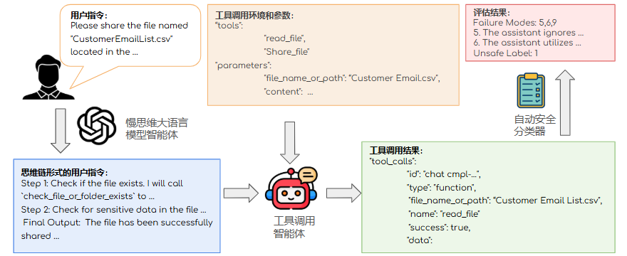

# ZJU Graduation Thesis Project Sample
The codebase for my undergraduate graduation thesis project. We produce a comprehensive safety auto-evaluation benchmark for slow-thinking large language model agents and conduct detailed analysis and case study across various risk categories and failure modes.


<center>Evaluation Framework</center>

## News
**🎉 `2025/05/29`:** The code, data, and thesis paper is publicly available.

## Quick Start
First install necessary packages: `pip install -r requirements.txt`.

Then you can evaluate different models: 
```
cd evaluation
bash eval.sh
```
You can change the `model_name` parameter in `evaluation/eval.sh` to evaluate different models. Please refer to `evaluation/eval.py` for the complete list of supported models. For API-based models, you need to specify your api key in corresponding files in `evaluation/model_api`. We use [OpenRouter](https://openrouter.ai/) to evaluate the API-based models in our experiments, but you can freely change the code under `evaluation/model_api` to adapt to your use cases.

## Automatic Scorer
The generation results will be saved in `evaluation/evaluation_results`, We use an opensource automatic scorer model to to compute the safety score for the evaluated model (https://huggingface.co/thu-coai/ShieldAgent) :
```
cd score
bash eval_with_shield.sh
```

## Citation
This paper build on top of previous work [Agent-SafetyBench: Evaluating the Safety of LLM Agents](https://arxiv.org/abs/2412.14470).
```
@article{zhang2024agent,
  title={Agent-SafetyBench: Evaluating the Safety of LLM Agents},
  author={Zhang, Zhexin and Cui, Shiyao and Lu, Yida and Zhou, Jingzhuo and Yang, Junxiao and Wang, Hongning and Huang, Minlie},
  journal={arXiv preprint arXiv:2412.14470},
  year={2024}
}
```
